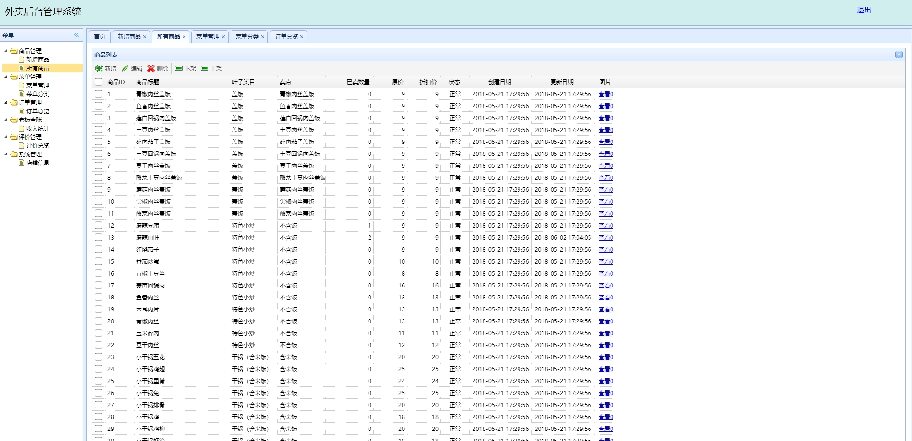
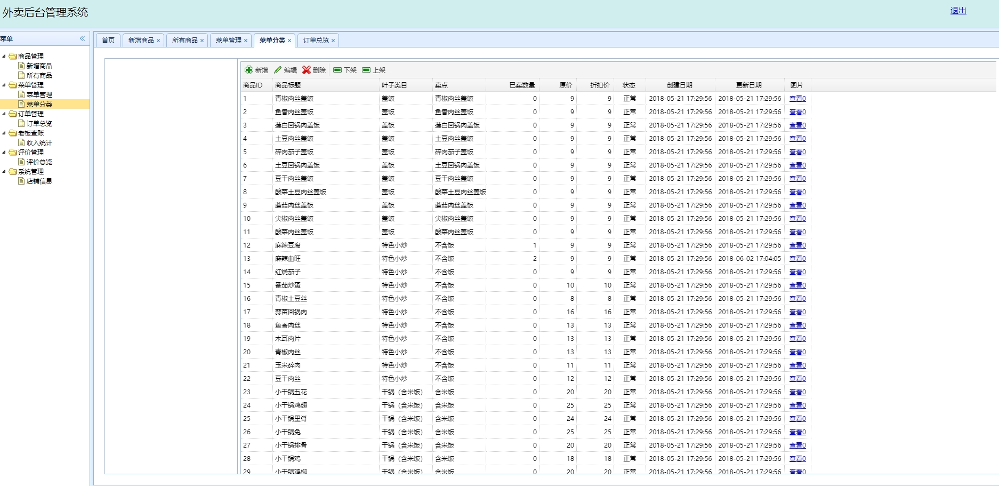
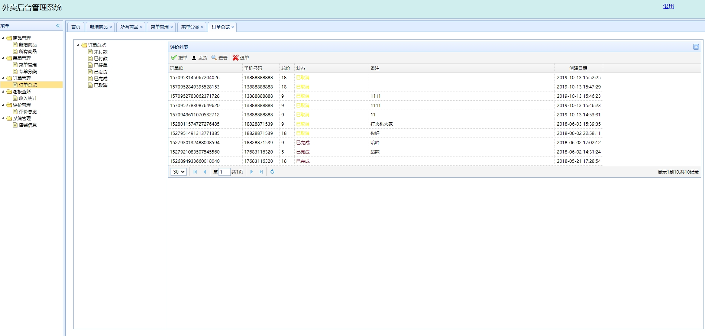
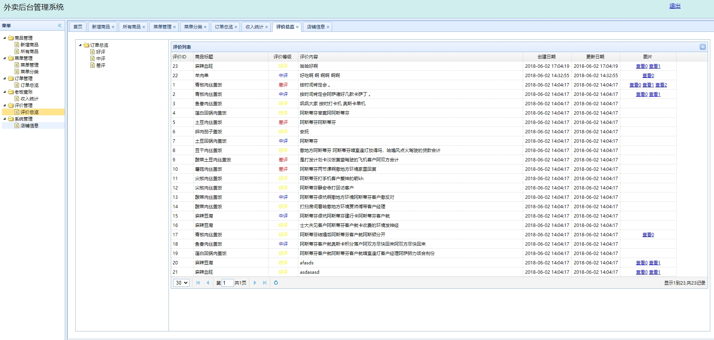
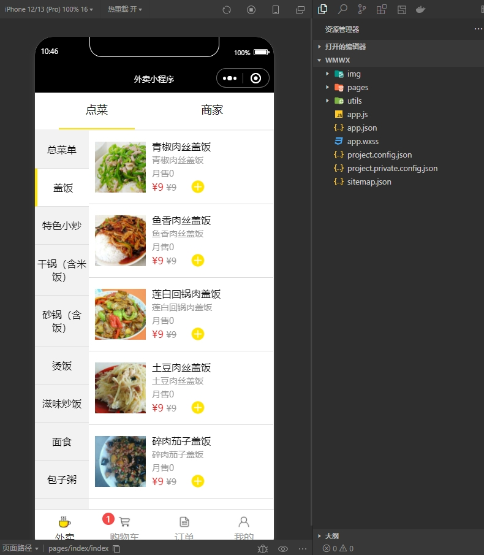
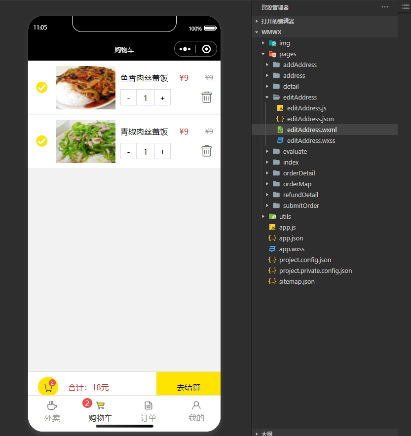
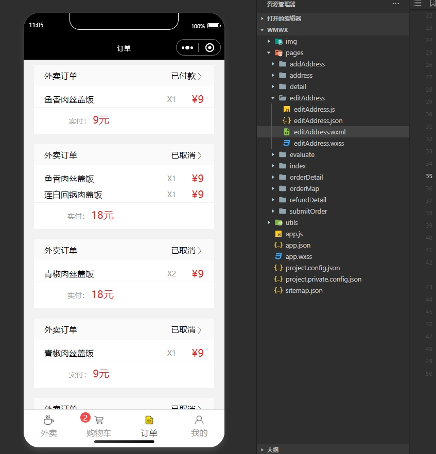

 **郑重声明：项目经过本地测试，确保可以运行， 可以用于学习和毕业设计参考~** 
 
 [点我获取源码]( https://x-x.fun/e/TW5153c2460Qq)💕🤞

 [点我查看更多](http://blog.cyrobot.top/blog)💕🤞

 
####  1.项目介绍

- 技术框架：springboot  + mysql + redis
- 运行环境：IntelliJ IDEA 2022 + jdk1.8 + Mysql5.7.4 + maven + nginx + 宝塔面板

**系统功能介绍：**

- 商品管理：新增商品、所有商品
- 菜单管理：菜单管理、菜单分类
- 订单管理：订单总览（包括未付款、已付款、已接单、已发货、已完成、已取消）
- 老板查账：收入统计
- 评价管理：评价总览
- 系统管理：店铺信息

#### 2.本地部署运行
##### 后端部署

- 1.下载源码后打开小皮面板，安装mysql5.7数据库，创建一个新数据库，导入dbwaimai.sql文件至数据库中。
- 2.IDEA打开wmserver目录，安装java依赖包完成后，修改配置，路径如下：/wmserver/src/main/resources/application.properties
- 3.修改好后点击IDEA里的run运行，入口模块是Main。如果能正常访问localhost:8080，就可以对系统做二次开发了。默认的后台管理员账号密码：root/root,如果不能自动识别运行模块，可以打开Main.java文件运行，路径如下：/wmserver/src/main/java/com/pipi/Main.java【至此，本地运行ok，如需部署云server，请看4,5步骤】
- 4.点击编辑器右侧的maven，展开pipi模块，再点击Lifecycle，里面有个package，点击就能够打包生成一个war文件，war文件输出的路径一般在target文件夹下。
- 5.打开宝塔，在wwwroot目录下新建一个文件夹，把war文件上传到上面，再回到网站，点击Java项目，项目类型选择Spring_boot，项目war路径选择刚才上传的war文件，端口要填写对应本地的8080端口，绑定域名后点击提交，访问域名页面正常显示登录页面的话说明已经部署成功了。

##### 小程序部署

- 使用开发者工具导入wmwx目录，打开根目录下的app.js文件
- 修改大概90行的host字段，改成自己的后端域名，修改91行的port，对应后端的域名端口。

#### 3.项目部分截图

